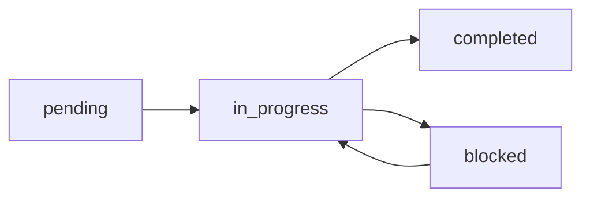

# Agile GenAI - AI Agent Instructions

This file provides instructions for AI coding agents (Claude, Copilot, Cursor, etc.) on how to use Agile GenAI for task management.

## Overview

Agile GenAI is a CSV-based task management system. As an AI agent, you can read and update these files directly to track your work.

## File Locations

```
project/
├── agile/
│   ├── backlog.csv          # All tasks (read for context)
│   ├── current_sprint.csv   # Active tasks (UPDATE THIS)
│   ├── completed_tasks.csv  # Archive (move completed tasks here)
│   └── sprints.json         # Sprint definitions
```

## Critical Workflow Rules

### BEFORE Starting Any Task

1. **Read** `agile/current_sprint.csv` to find pending tasks
2. **Select** the next task based on priority and dependencies
3. **Update** the task status to `in_progress`
4. **Update** `progress_percent` to `0` or `25`

```csv
# Example: Mark task as started
id,title,category,status,priority,owner,due_date,estimate_hours,progress_percent,dependencies,notes
TASK-001,Implement Login,Backend,in_progress,high,AI Agent,2025-01-10,4,25,"",Starting implementation
```

### DURING Task Execution

- Update `progress_percent` as you make progress (0, 25, 50, 75, 100)
- Add notes about what you're doing in the `notes` field
- If blocked, change status to `blocked` and explain in notes

### AFTER Completing a Task

1. **Update** status to `completed`
2. **Set** `progress_percent` to `100`
3. **Add** completion notes
4. **Move** the task to `completed_tasks.csv` (optional)
5. **Read** the sprint again for the next task

```csv
# Example: Mark task as completed
TASK-001,Implement Login,Backend,completed,high,AI Agent,2025-01-10,4,100,"",Login feature implemented with JWT auth
```

## CSV Column Reference

### current_sprint.csv
| Column | Description | Values |
|--------|-------------|--------|
| id | Unique task identifier | e.g., TASK-001, FEAT-002 |
| title | Short task name | e.g., "Implement Login" |
| category | Task type | Backend, Frontend, Bug, Feature, etc. |
| status | Current state | `pending`, `in_progress`, `completed`, `blocked` |
| priority | Importance | `critical`, `high`, `medium`, `low` |
| owner | Assigned to | e.g., "AI Agent", "Developer" |
| due_date | Target date | YYYY-MM-DD format |
| estimate_hours | Estimated effort | Number |
| progress_percent | Completion % | 0-100 |
| dependencies | Blocking tasks | Comma-separated task IDs |
| notes | Context/updates | Free text |

### backlog.csv
| Column | Description |
|--------|-------------|
| id | Unique identifier |
| category | Task type |
| title | Task name |
| description | Detailed description |
| priority | Importance level |
| phase | Sprint/phase assignment |
| status | Current state |
| estimate_hours | Estimated effort |
| owner | Assigned to |

## Example Agent Workflow

```
User: "Work on the next task in the sprint"

Agent Actions:
1. READ agile/current_sprint.csv
2. FIND first task with status="pending" (respecting dependencies)
3. UPDATE that task: status="in_progress", progress_percent=25
4. IMPLEMENT the feature/fix
5. UPDATE task: progress_percent=50, 75, etc. as you progress
6. COMPLETE: status="completed", progress_percent=100
7. ADD notes describing what was done
8. READ sprint again for next task
```

## Status Transitions



## Dependency Handling

- Check the `dependencies` column before starting a task
- If dependencies are not completed, skip to the next task
- Example: `dependencies="TASK-001,TASK-002"` means both must be done first

## Best Practices

1. **Always update the CSV** before and after working on a task
2. **Be specific in notes** - future agents will read them
3. **Respect priorities** - work on critical/high tasks first
4. **Check dependencies** - don't start blocked tasks
5. **Keep progress updated** - helps track velocity

## Quick Reference Commands

For agents with file system access:

```bash
# View current sprint tasks
cat agile/current_sprint.csv

# View backlog
cat agile/backlog.csv

# Check completed tasks
cat agile/completed_tasks.csv
```

## Integration with Claude Code

Add this to your project's `CLAUDE.md` or `.claude/CLAUDE.md`:

```markdown
## Task Management

This project uses Agile GenAI for task tracking.

- Before starting work: Read `agile/current_sprint.csv`
- Update task status to `in_progress` when starting
- Update `progress_percent` as you work (25, 50, 75, 100)
- Mark `completed` when done
- Always add notes about what was done
```

---

**Remember: The CSV files are your source of truth. Keep them updated!**
